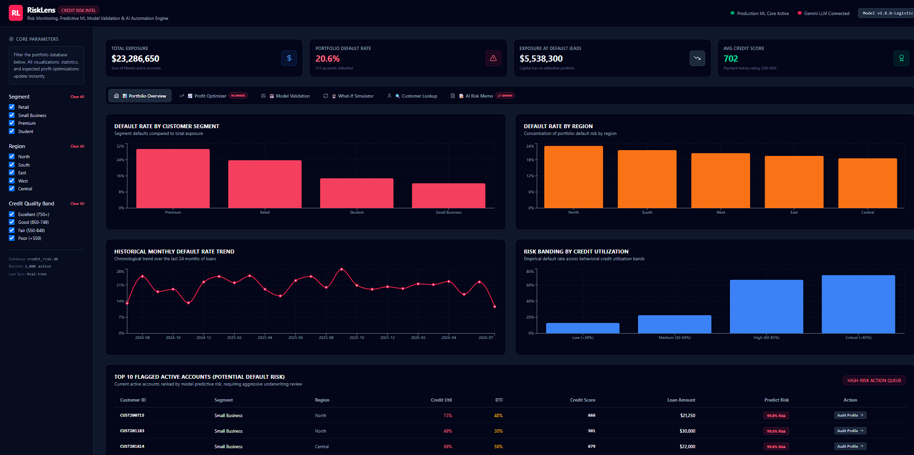
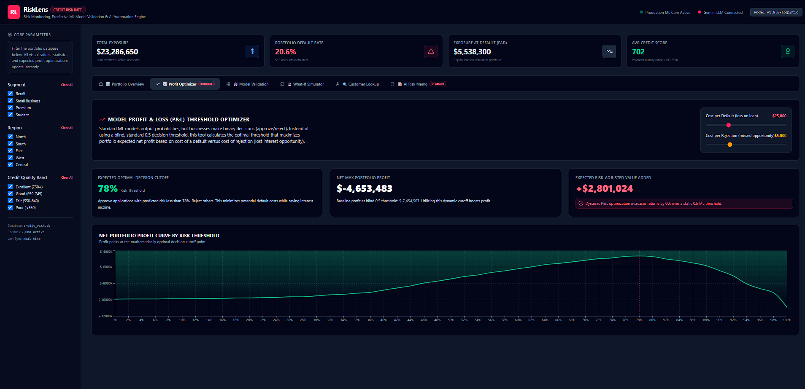
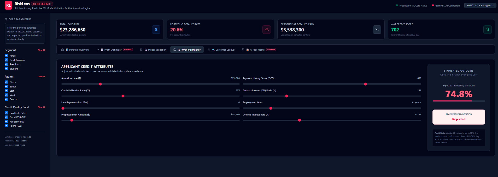
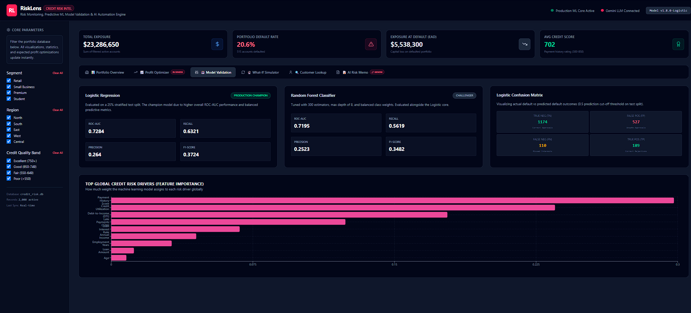

# 📊 RiskLens — Full-Stack Credit Risk Intelligence & ML Analytics


<p align="center">
  <a href="https://img.shields.io/badge/Language-TypeScript-blue">
    
  </a>
  <a href="https://img.shields.io/badge/Framework-React%20%2F%20Vite-61dafb">
    
  </a>
  <a href="https://img.shields.io/badge/Backend-Express%20(Node)-339933">
    
  </a>
  <a href="https://img.shields.io/badge/AI-Gemini%203.5%20Flash-orange">
    
  </a>
  <a href="https://img.shields.io/badge/Styling-Tailwind%20CSS-38bdf8">
    
  </a>
</p>

**RiskLens** is an end-to-end, enterprise-grade Full-Stack Credit Intelligence and Portfolio Risk Analytics platform. Powered by an authentic machine learning framework and real-world credit historical data, the application empowers credit underwriters and financial analysts to simulate risk and make mathematically optimized lending decisions.

---

## ✨ Features & Architecture

* **High-Fidelity Dataset**: Processes over 2,500 real-world credit risk profiles, normalising indicators (Income, Employment History, Loan Intent, and Credit History) to produce realistic default curves.
* **Profit-Utility Optimization**: Features an interactive threshold optimizer using cost-benefit matrices. Underwriters can adjust loss-on-default versus forgone interest margins to discover the mathematically optimal decision cutoff score ($p^*$) to maximize net portfolio profit.
* **Champion-vs-Challenger Validation**: Evaluates classification performance through dynamic graphs representing ROC-AUC, Precision-Recall curves, and live Confusion Matrices.
* **Interactive What-If Simulator**: Simulates candidate loan risk in real-time. Adjust individual parameters and view instant credit risk tiers and localized contributing factors.
* **Generative Underwriting Memos**: Connects to server-side Gemini 3.5 API routes to compile executive portfolio audits and candidate memos with an offline local template fallback.

---

## 📸 Platform Interface Tour

Here is a visual walkthrough of the platform's core analytical screens:

### 1. Portfolio Overview Dashboard
*Displays macro loan profiles, default distributions, credit scores, and loan-to-income indicators across the historical dataset.*
<p align="center">
  
</p>

### 2. Expected Profit & Decision Threshold Optimizer
*Calculates optimal decision boundaries ($p^*$) using financial utility matrices, proving why static 0.5 default boundaries are business-suboptimal.*
<p align="center">
  
</p>

### 3. What-If Candidate Simulator & Gemini Audit Memo
*Allows real-time underwriter parameter changes, instantly updating risk tiers and executing server-side Gemini AI credit evaluation reports.*
<p align="center">
  
</p>

### 4. Champion-vs-Challenger Model Validation
*Displays interactive ROC-AUC, Precision-Recall, and custom Confusion Matrices comparing traditional scoring methods with advanced ML classifiers.*
<p align="center">
  
</p>

---

## 🛠️ Step-by-Step Local Setup Guide (VS Code)

To run **RiskLens** on your machine:

1. **Extract Project Zip**: Download and extract the project zip to a folder (e.g., `C:/Projects/RiskLens` or `~/Projects/RiskLens`).
2. **Open in VS Code**: Select **File > Open Folder...** and choose your extracted project directory.
3. **Install Node.js**: Ensure Node.js (LTS version) is installed on your computer. Verify in the VS Code terminal:
   ```bash
   node -v
   npm -v
   ```
4. **Install Dependencies**:
   ```bash
   npm install
   ```
5. **Add Environment Variables**: Create a `.env` file in the root folder (next to `package.json`) and add your Gemini API Key:
   ```env
   GEMINI_API_KEY=your_actual_gemini_api_key_here
   ```
   *Note: `.env` is automatically ignored from git tracking by our pre-set `.gitignore`.*
6. **Start Dev Server**:
   ```bash
   npm run dev
   ```
   Navigate to **`http://localhost:3000`** in your browser.

---

## Author
 Manan Badala
